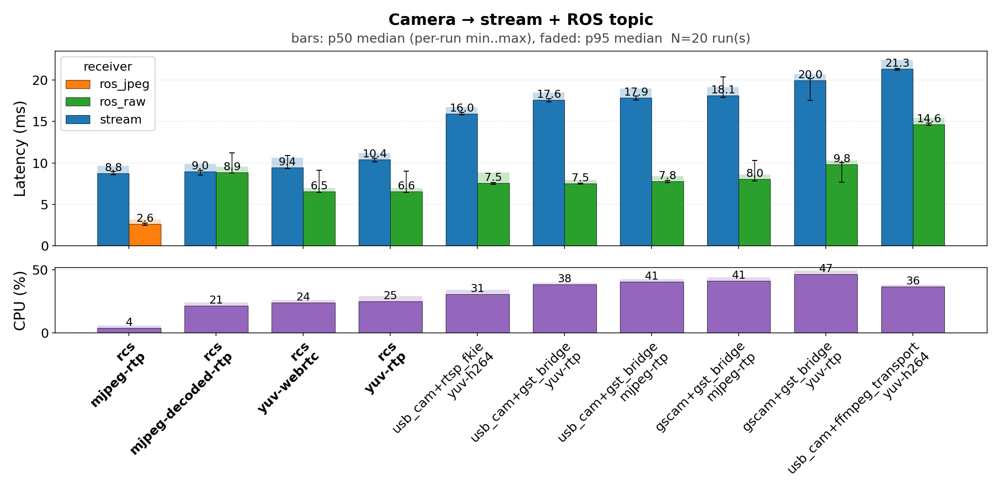
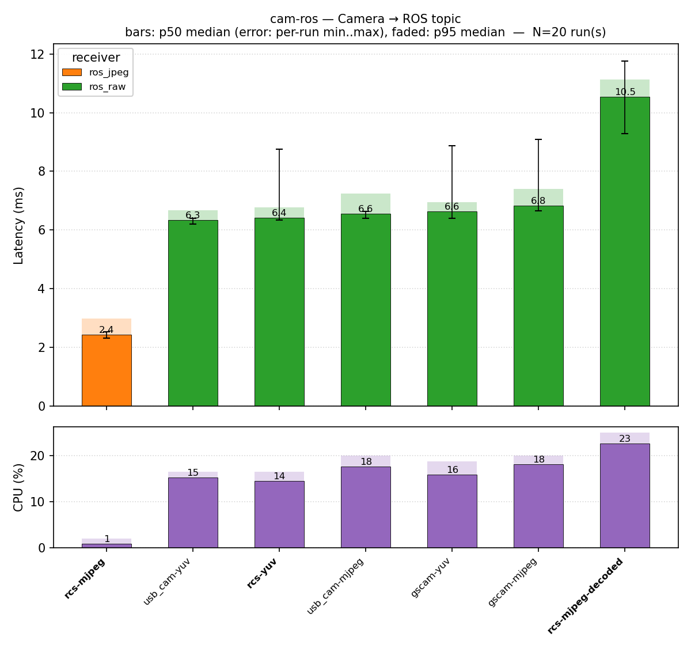
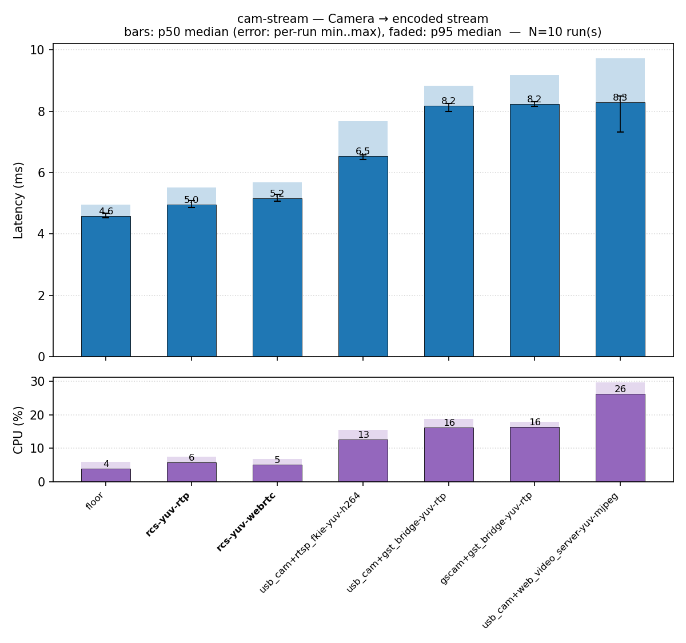
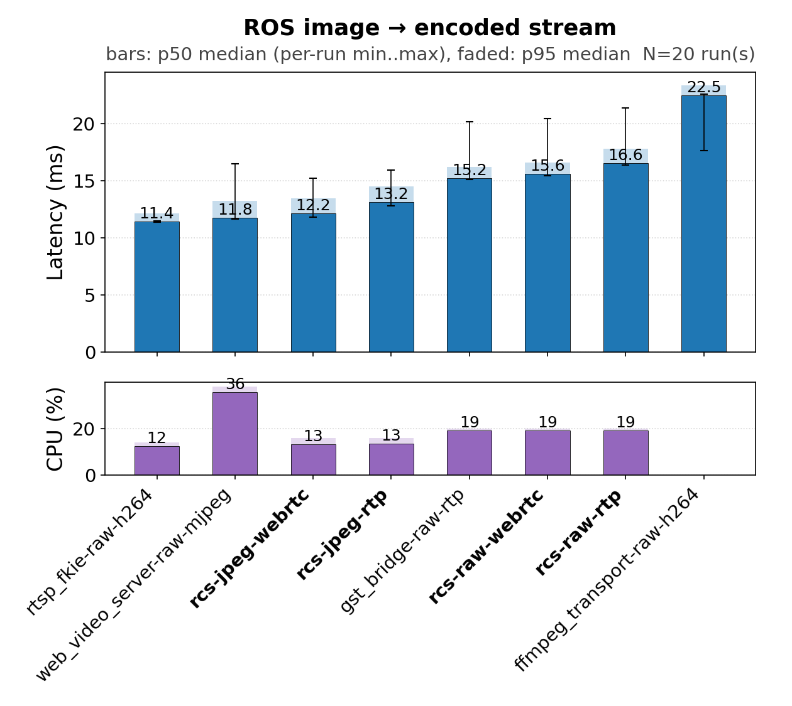

# ros_camera_server_benchmarks

End-to-end latency benchmark harness comparing [`ros_camera_server`](https://www.github.com/StefanFabian/ros_camera_server)
against `usb_cam`, `gscam`, `ros-gst-bridge`, `web_video_server`, and
`rtsp_image_transport`. Each frame carries a pixel-domain marker with
a `CLOCK_MONOTONIC` timestamp; receivers decode it after their normal
display path and report producer-to-consumer latency.

The methodology, fairness controls, pipeline commands, and cost-layer
breakdown live in [METHODOLOGY.md](METHODOLOGY.md).
Setup, run instructions, full env-var reference, and the per-scenario
matrix live in [REPRODUCING.md](REPRODUCING.md).

## Stacks compared

| Stack                  | Role                   | Transports exercised        |
| ---------------------- | ---------------------- | --------------------------- |
| `ros_camera_server`    | Subject under test     | UDP-RTP, WebRTC, ROS topic  |
| `usb_cam`              | V4L2 → ROS driver      | ROS topic (+ bridge to RTP) |
| `gscam`                | V4L2 → ROS driver      | ROS topic (+ bridge to RTP) |
| `ros-gst-bridge`       | ROS → GStreamer bridge | UDP-RTP H.264               |
| `web_video_server`     | ROS → HTTP             | HTTP MJPEG                  |
| `rtsp_image_transport` | ROS → RTSP (FKIE)      | RTSP H.264                  |

## Scenario groups

| Group        | Measures                         |
| ------------ | -------------------------------- |
| `cam-ros`    | Camera → ROS topic only          |
| `cam-stream` | Camera → encoded stream (no ROS) |
| `ros-stream` | ROS image input → encoded stream |
| `cam-both`   | Camera → both stream + ROS topic |

## Headline takeaway

On the notebook results in [RESULTS.md](RESULTS.md):

- **Lowest end-to-end latency on every encoded-stream group is
  `ros_camera_server`.** Its `yuv-rtp` and `yuv-webrtc` paths sit
  ~0.4–0.6 ms above the bare gst-launch UDP-RTP floor (4.59 ms) and
  are tied within run-to-run noise (cam-stream: 4.95 ms vs 5.17 ms;
  cam-both: 5.18 ms vs 5.28 ms).
- **`rtsp_image_transport` (FKIE)** is the closest non-rcs stream
  stack at ~6.5–7.1 ms.
- **`gst_bridge`-based stacks** add ~3–4 ms over the floor — that gap
  is pipeline overhead, not framing cost (the wire format is identical).
- **On `cam-ros` (raw topic only)** `rcs-yuv`, `usb_cam-yuv`, and
  `gscam-yuv` are within ~0.1 ms of each other (~2.8–2.9 ms).
  `cam-ros-rcs-mjpeg` passthrough is uniquely cheap (1.80 ms) because
  the ROS topic carries `CompressedImage` and no decode happens.

In summary, this shows that despite the significantly easier configuration, the [ros_camera_server](https://www.github.com/StefanFabian/ros_camera_server) is at least competitive and in some cases even faster than alternative tuned approaches.

## Plots

## Further reading

- [RESULTS.md](RESULTS.md) — full per-scenario tables.
- [METHODOLOGY.md](METHODOLOGY.md) — marker, fairness controls,
  pipeline commands, caveats, and stacks intentionally excluded.
- [REPRODUCING.md](REPRODUCING.md) — setup, env vars, scenario matrix.
